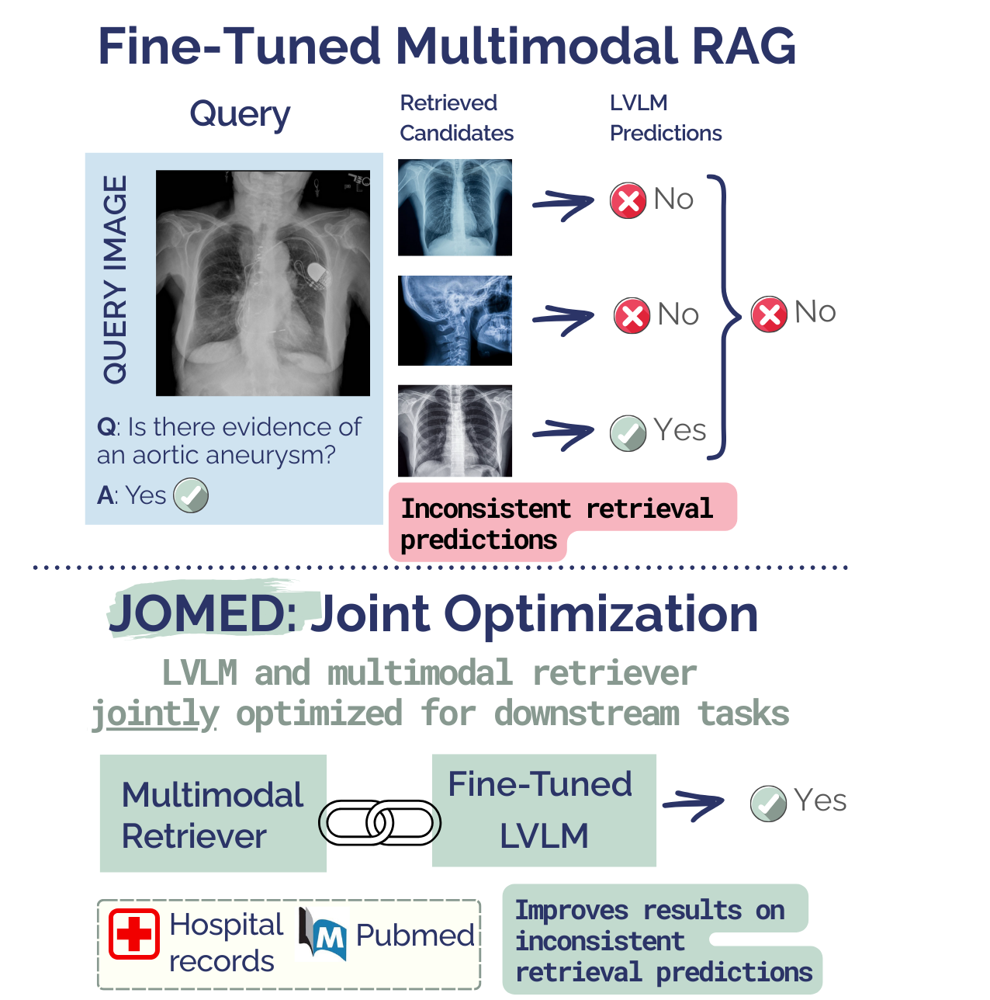
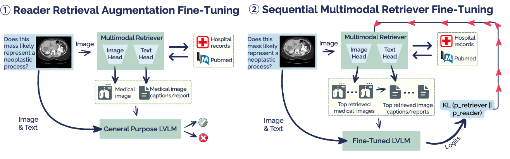

# Lightweight Joint Optimization of General-Purpose Vision-Language Models and Retrievers for Medical Diagnosis


## Project Overview

Clinical decision-making often involves interpreting medical images (e.g., radiology) to make diagnoses. Retrieving relevant visual information from medical literature and hospital records can enhance diagnostic accuracy.

JOMED (Joint Optimization of Multimodal Retrieval for Enhanced Medical Diagnosis) introduces a model in which a multimodal retriever is jointly optimized with a Large Vision-Language Model (LVLM) for medical diagnosis. This differs from standard Retrieval-Augmented Generation (RAG), where LVLM error signals are not propagated to the retriever. Using only general-purpose backbones with lightweight fine-tuning, our model achieves competitive results compared to medically pretrained models across clinical multi-label classification and visual question answering tasks. In addition, JOMED significantly improves performance on challenging cases where different top-retrieved images lead to different predictions for the same target—cases that are empirically difficult for all models. Our method is based on a general-purpose LVLM and a multimodal retriever. First, we train the LVLM to utilize the retrieved data; then, we train the retriever to supply relevant context to the model.


|  |  |
|:---:|:---:|
|  |  |


## Environment Setup

### Main Environment

```bash
git clone <Add here>
cd JOMED
export PYTHONPATH=./
python3.9 -m venv jomed_env
source jomed_env/bin/activate
pip install -r requirements.txt
```

### Qwen2-VL Environment

For running the qwen2_vl model, a different environment is needed:

```bash
git clone <Add here>
cd JOMED
export PYTHONPATH=./
python3.9 -m venv jomed_qwen_env
source jomed_qwen_env/bin/activate
pip install -r requirements_qwen.txt
```
## Index Initialization

### Convert Datasets to JSONL Format
Download the required datasets:
- **ROCO**: https://github.com/razorx89/roco-dataset
- **PMC-OA**: https://huggingface.co/datasets/axiong/pmc_oa
- **MIMIC-CXR**: https://physionet.org/content/mimic-cxr-jpg/ (permission required)

Organize the datasets into JSONL format:

#### MIMIC-CXR

```bash
python preporcess/mimic_cxr_processor.py --path_folder_location /path/to/mimic/dataset --path_save /path/to/save/output
```

#### PMC-OA

```bash
python preporcess/prepare_pmc_oa_for_embeddings.py --home_pmc_oa_project /path/to/project/PYCHARMPROJECTS/PMC_OA/ --home_pmc_oa_images /path/to/images/ --path_save /path/to/save/output
```

#### ROCO

```bash
python preporcess/organize_roco_for_embedding.py --home_pmc_oa_project /path/to/project/PYCHARMPROJECTS/PMC_OA/ --home_pmc_oa_images /path/to/images/ --path_save /path/to/save/output
```

#### Merge Datasets

Merge the three JSONL files into a final one:

```bash
python preporcess/merge_jsonl.py --mimic_file path/to/mimic-cxr.jsonl --roco_file path/to/roco.jsonl --pmc_file path/to/pmc-oa.jsonl --output_file merged_datasets.jsonl
```

### Create Embeddings Index

The scripts vqarad_embeddings_pmc_encode_img.sh and vqarad_embeddings_pmc_encode_text.sh are used to encode the image and text
embeddings. In each script, the arguments '--passages' and '--save_index_path' need to be updated.
Then run the index creation:

#### Image Embeddings

```bash
source run_scripts/create_embeddings/vqarad_embeddings_pmc_encode_img.sh
```

#### Text Embeddings

```bash
source run_scripts/create_embeddings/vqarad_embeddings_pmc_encode_text.sh
```

## Training the Reader

The reader is trained on the LlamaFactory platform. We supply scripts for preparing the data and training in `lamafactory_scripts/README.md`

## Training the retriever

Training scripts for each benchmark are available in `run_scripts/training_scripts/`.

### Dataset Downloads

#### MedMNIST Datasets
For breast, retina, and derma datasets:
- **MedMNIST**: https://medmnist.com/

#### PhysioNet Datasets (Approval Required)
- **BREST**: https://physionet.org/content/brazilian-ophthalmological/1.0.0/
- **VinDR-PCXR**: https://physionet.org/content/vindr-pcxr/1.0.0/

#### VQA Datasets (HuggingFace)
- **VQA-RAD**: https://huggingface.co/datasets/flaviagiammarino/vqa-rad
- **SLAKE-English**: https://huggingface.co/datasets/mdwiratathya/SLAKE-vqa-english
- **PathVQA**: https://huggingface.co/datasets/flaviagiammarino/path-vqa

After downloading the data, follow the instructions in `data/README.md` (Coming Soon).

### Training Steps

Train the multimodal retriever in two stages:
1. **Text retriever head**
2. **Image retriever head**

For each script, update:
- Reader checkpoint path
- Index paths (text and image)
- Checkpoint directory

#### Text Retriever Head Training

```bash
source run_scripts/training_retriever_text/<name_benchmark>/<chosen_script>
```

#### Image Retriever Head Training

```bash
source run_scripts/training_retriever_image/<name_benchmark>/<chosen_script>
```

## Evaluation

### Calculate Metrics

Use `calculate_metrics.py` to compute evaluation metrics from prediction files:

```bash
python calculate_metrics.py \
  --prediction_file /path/to/predictions.jsonl \
  --classes "0" "1" "2" "3" "4"
```

#### Arguments

- `--prediction_file`: Path to JSONL file containing model predictions (required)
- `--classes`: List of class labels for classification tasks (required)


## Citation

If you use this code in your research, please cite our paper:

```bibtex
@article{mazor2025lightweight,
  title={Lightweight Joint Optimization of General-Purpose Vision-Language Models and Retrievers for Medical Diagnosis},
  author={Mazor, Nir and Hope, Tom},
  journal={arXiv preprint arXiv:2508.17394},
  year={2025}
}
```
